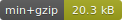
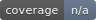

<p align="center">
  
  
</p>

<p align="center">
  <strong>Type-safe dynamic model factory for <a href="https://effector.dev">effector</a></strong>
  <br />
  Contracts, reactive instances, and ORM-like queries — with full SSR support.
</p>

<p align="center">
  <a href="https://www.npmjs.com/package/@kbml-tentacles/core"></a>
  
  
  <a href="./LICENSE"></a>
  
</p>

---

## What is Tentacles?

Tentacles turns **effector** into a batteries-included state framework. Declare a contract with a fluent chain builder, instantiate as many independent models as you like, and query them like an in-memory ORM — all reactive, all SSR-safe, all fully typed with zero manual annotations.

```ts
import { createContract, createModel, eq } from "@kbml-tentacles/core"

const todoContract = createContract()
  .store("id",    (s) => s<number>().autoincrement())
  .store("title", (s) => s<string>())
  .store("done",  (s) => s<boolean>().default(false))
  .event("toggle", (e) => e<void>())
  .pk("id")

const todoModel = createModel({
  contract: todoContract,
  fn: ({ $done, toggle }) => {
    $done.on(toggle, (d) => !d)
    return {}
  },
})

todoModel.create({ title: "Learn Tentacles" })
todoModel.create({ title: "Ship it" })

const active = todoModel.query().where("done", eq(false))
active.$list  // Store<Row[]> — auto-updates
```

## Why

Writing non-trivial effector apps means hand-rolling the same scaffolding over and over: record maps, id lists, setters, getters, combiners, SIDs. Tentacles collapses that into a one-line-per-field contract.

- **Contract-first** — add a field, add one line. Types flow everywhere.
- **Dynamic instances** — hundreds of isolated instances from one model, each with deterministic SIDs.
- **Zero-cost field proxies** — per-instance `$field` accessors are proxy objects, not real effector stores. Stores materialize only when needed (e.g. `combine`, `sample`).
- **Reactive queries** — `WHERE` / `ORDER BY` / `LIMIT` / `GROUP BY` as composable stores. Incremental updates: O(1) on field mutations, not O(N).
- **Refs & relationships** — one-to-one, one-to-many, inverse refs, self-references, compound FKs. Inline create, cascade delete.
- **SSR out of the box** — serialize/fork hydration with zero config.
- **Forms, done right** — `@kbml-tentacles/forms` brings the same contract-driven design to form state, validation, and arrays.

## Install

```sh
npm install effector @kbml-tentacles/core
# or
yarn add effector @kbml-tentacles/core
# or
pnpm add effector @kbml-tentacles/core
```

## Full example with React

```tsx
// todo.ts
import { createContract, createModel } from "@kbml-tentacles/core"

const todoContract = createContract()
  .store("id",    (s) => s<number>().autoincrement())
  .store("title", (s) => s<string>())
  .store("done",  (s) => s<boolean>().default(false))
  .event("toggle", (e) => e<void>())
  .pk("id")

export const todoModel = createModel({
  contract: todoContract,
  fn: ({ $done, toggle }) => {
    $done.on(toggle, (d) => !d)
    return {}
  },
})
```

```tsx
// todo-view.ts
import { createViewContract, createViewModel, eq } from "@kbml-tentacles/core"
import { todoModel } from "./todo"

const todoViewContract = createViewContract()
  .store("draftTitle", (s) => s<string>().default(""))

export const todoViewModel = createViewModel({
  contract: todoViewContract,
  fn: ({ $draftTitle }) => ({
    $draftTitle,
    $activeCount: todoModel.query().where("done", eq(false)).$count,
    $doneCount:   todoModel.query().where("done", eq(true)).$count,
  }),
})
```

```tsx
// App.tsx
import { useUnit } from "effector-react"
import { Each, View, useModel } from "@kbml-tentacles/react"
import { todoModel } from "./todo"
import { todoViewModel } from "./todo-view"

function TodoItem() {
  const todo  = useModel(todoModel)
  const title = useUnit(todo.$title)
  const done  = useUnit(todo.$done)
  return (
    <li style={{ textDecoration: done ? "line-through" : "none" }}>
      <input type="checkbox" checked={done} onChange={todo.toggle} />
      {title}
    </li>
  )
}

export default function App() {
  return (
    <View model={todoViewModel}>
      <ul>
        <Each model={todoModel} source={todoModel.$ids}>
          <TodoItem />
        </Each>
      </ul>
    </View>
  )
}
```

`<View>` is the primary pattern — it scopes a view model to a subtree and exposes its shape via context. Descendants pick it up with `useModel(todoViewModel)`.

## Packages

| Package | Description |
|---|---|
| [`@kbml-tentacles/core`](./packages/core) | Contracts, models, queries, view-models, SSR scope isolation |
| [`@kbml-tentacles/forms`](./packages/forms) | Contract-driven reactive forms with validation, arrays, submission |
| [`@kbml-tentacles/react`](./packages/react) | React adapter — `<View>`, `<Each>`, `useModel`, `useView` |
| [`@kbml-tentacles/vue`](./packages/vue) | Vue adapter |
| [`@kbml-tentacles/solid`](./packages/solid) | Solid adapter |
| [`@kbml-tentacles/forms-react`](./packages/forms-react) | React form bindings |
| [`@kbml-tentacles/forms-vue`](./packages/forms-vue) | Vue form bindings |
| [`@kbml-tentacles/forms-solid`](./packages/forms-solid) | Solid form bindings |
| [`@kbml-tentacles/forms-zod`](./packages/forms-zod) | Zod schema adapter |
| [`@kbml-tentacles/forms-yup`](./packages/forms-yup) | Yup schema adapter |
| [`@kbml-tentacles/forms-joi`](./packages/forms-joi) | Joi schema adapter |
| [`@kbml-tentacles/forms-valibot`](./packages/forms-valibot) | Valibot schema adapter |
| [`@kbml-tentacles/forms-arktype`](./packages/forms-arktype) | ArkType schema adapter |

## Documentation

Full documentation at **[tentacles docs](./docs)** (run `yarn docs` to preview locally).

- [Tutorials](./docs/tutorials) — your first model, React/Vue/Solid todo apps, your first form
- [How-to guides](./docs/how-to) — contracts, refs, queries, SSR, validation, form arrays
- [Reference](./docs/reference) — full API

## Development

```sh
yarn install
yarn build       # build all packages
yarn test        # run vitest
yarn test:leaks  # memory / scope leak suite
yarn typecheck
yarn lint
yarn docs        # serve docs locally
yarn example     # run the Next.js SSR example
```

## License

[MIT](./LICENSE) © Nikita Lumpov
